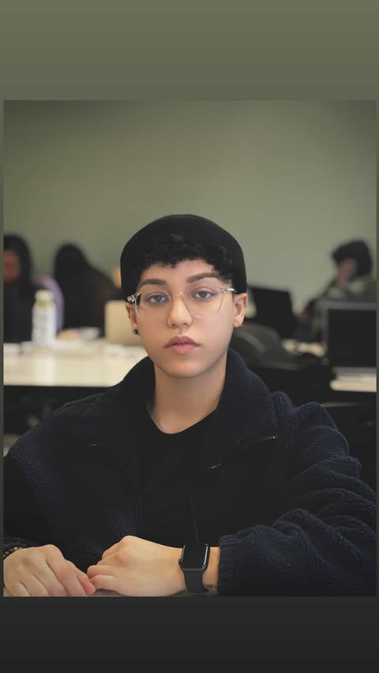

<!DOCTYPE html>
<html lang=« en »>
<head>
    <meta charset=« UTF-8 »>
    <meta name=« viewport » content=« width=device-width, initial-scale=1.0 »>
    <title>Arij Nejjar</title>
</head>
<body>
    <h1>Arij Nejjar</h1>
    

    <dl>
        <dt>Student Number</dt>
        <dd>041166779</dd>
    
        <dt>Program</dt>
        <dd>Interactive Media Design</dd>
    
        <dt>Course</dt>
        <dd>MTM6201 - Web Development II</dd>
    
        <dt>Interesting Fact</dt>
        <dd>I Learned To Play Football at a very young age.</dd>
      </dl>
    
      <footer>
        
&copy;2025 Arij Nejjar

    </footer>
        
</body>
</html>

